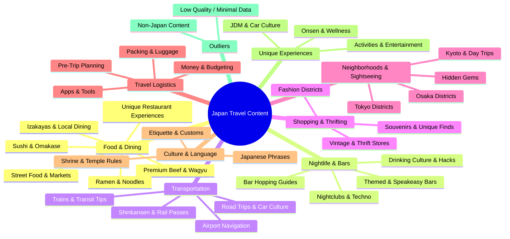

# 🗾 Japan Travel Content: Cluster Analysis & Knowledge Map

> **Dataset Overview:** 130+ short-form video posts covering Japan travel, food, nightlife, culture, shopping, transportation, and more. All content is Japan-focused (with rare exceptions), created by travelers, expats, locals, and tourism professionals.

---

## 📊 Cluster Visualization



---

## 🍖 CLUSTER 1: Premium Beef & Wagyu Experiences

**Posts:** `post_0014`, `post_0025`, `post_0067`, `post_0105`, `post_0108`, `post_0154`, `post_0184`

### Items & Details

| Post | Location/Restaurant | Key Detail |
|------|-------------------|------------|
| `post_0014` | Unnamed wagyu burger restaurant, **Osaka** | Wagyu steak burger with cured egg yolk; uses smash patties brushed with wagyu fat; honey-glazed brioche bun |
| `post_0025` | **Yakiniku Jambo**, Tokyo | Top 10 wagyu restaurants in Tokyo; warns against trusting Google/Tabelog reviews |
| `post_0067` | Unnamed restaurant (100% wagyu beef) | Wagyu burger balls grilled over charcoal; served with rice, clear soup, ponzu; lunch set format |
| `post_0105` | **Slice of Life** food truck, Osaka area | Texas BBQ-style wagyu; pit master Hagiwara learned via YouTube; beef ribs over rice |
| `post_0108` | **Jambo Hanare**, Tokyo | ~$130/person prefix course; A5 sirloin, Chateaubriand, beef tongue, beef sushi; possibly best meal of 2026 |
| `post_0154` | **Tokito Sandwich**, Osaka side street alleyway | Wagyu sandwiches and subs; fully wagyu-focused menu |
| `post_0184` | **Mikuya**, Osaka | Wagyu specialty shop; premium steak; highly recommended |

### Why They Cluster
All posts center on wagyu beef as the star attraction — from street food trucks to high-end yakiniku courses. They share a tone of reverence for beef quality and preparation craftsmanship, often describing experiences as life-changing.

---

## 🍣 CLUSTER 2: Sushi & Omakase Culture

**Posts:** `post_0030`, `post_0031`, `post_0065`, `post_0109`, `post_0113`

### Items & Details

| Post | Location/Restaurant | Key Detail |
|------|-------------------|------------|
| `post_0030` | **Sushi Hatsume**, Shinjuku, Tokyo | 22-dish omakase course; three taboos explained (no multi-bite, eat immediately, know the counter items) |
| `post_0031` | **Unnamed sushi spot**, Shinjuku; **Izakaya 50**, Kanda; **Chiyoda**, Nakano | 10 yen per piece sushi/sashimi/tempura; budget hidden gems |
| `post_0065` | **Fujisaku**, Tokyo | 750 yen meal; seasonal sushi; unagi rated 10/10 |
| `post_0109` | General Japan dining rules | Don't tip; eat sushi with hands; fish side in soy sauce; Japanese rating system explained (3.5 = excellent) |
| `post_0113` | **Kokane**, Tokyo | 90-year-old family-owned sushi restaurant; Edo-style cuisine; three generations |

### Why They Cluster
Posts share a focus on sushi etiquette, hidden value, and the cultural philosophy around sushi dining in Japan. Both high-end omakase and extreme budget sushi are represented, united by emphasis on authenticity and proper appreciation.

---

## 🍜 CLUSTER 3: Ramen & Noodle Experiences

**Posts:** `post_0036`, `post_0056`, `post_0107`, `post_0186`

### Items & Details

| Post | Location/Restaurant | Key Detail |
|------|-------------------|------------|
| `post_0036` | **Hakata Ichigo**, Komagome, Tokyo | Alternative to Ichiran; Hakata-style tonkotsu; 780 yen; nearby shrine with cat guardian and western-style manor |
| `post_0056` | **Usagi** (Nujabes Brothers Ramen), Tokyo | Truffle ramen; 2,300 yen; run by brother of artist Nujabes; Samurai Champloo connection |
| `post_0107` | **Ken's Ramen**, Yotsuya, Tokyo | 5-minute walk from Yotsuya Station; small, low-key; no long lines |
| `post_0186` | **Menya Musashi** (Tokyo); **Ginjo Ramen Kubota** (Kyoto) | Tsukemen (dipping ramen); cold thick noodles in concentrated hot broth; chef-recommended spots |

### Why They Cluster
All posts prioritize local, authentic ramen experiences over tourist-famous chains like Ichiran, and emphasize the discovery narrative — finding the "real" ramen of Japan.

---

## 🥘 CLUSTER 4: Street Food, Markets & Local Food Experiences

**Posts:** `post_0013` (partial), `post_0021`, `post_0023`, `post_0068`, `post_0097`, `post_0151`, `post_0159`, `post_0161`, `post_0188`, `post_0197`

### Items & Details

| Post | Location/Restaurant | Key Detail |
|------|-------------------|------------|
| `post_0013` | **Dotonbori Takoyaki Crawl** — favorites: **Yuachiban**, **Wanaka**, **Kukuru**, **Achiji Honpo** | Osaka takoyaki tour with friends |
| `post_0021` | Unnamed 130-year-old restaurant | Karage rice bowl; 6 pieces fried chicken + Kyoto dashi egg; 12 seats; bans under-13s |
| `post_0023` | **Taco Shop** (Viva Mexico truck), Japan | Tijuana-style tacos in Japan; taco de pastor (8.8/10), taco de cabeza (8.7/10); real trompo; yellow corn tortillas |
| `post_0068` | **Tsubami**, Kyoto | Okonomiyaki + takoyaki; owner cooks meticulously on griddle; small local spot |
| `post_0151` | **Sakimoto Bakery** (breakfast); **Nagi Kushiaki Izumo** (eel bowl); **Kuromon Market** (street food); Sushi conveyor (dinner) — all **Osaka** | Full-day Osaka street food crawl |
| `post_0159` | River fishing restaurant, Japan countryside | Fish your own meal in clean river; famous for real wasabi |
| `post_0161` | **Omelette Rice** restaurant, Tokyo | Preparation demonstration; fluffy omurice |
| `post_0197` | Cheap unnamed bar/restaurant, Japan | 2 yen sake jugs; octopus; crocodile dish; police costume waitress |

### Why They Cluster
These posts share a spirit of food adventure — eating cheaply or unusually, discovering unexpected cuisine, and immersing in culinary culture beyond fine dining.

---

## 🍶 CLUSTER 5: Izakayas — Local Drinking & Dining Spots

**Posts:** `post_0029`, `post_0064`, `post_0100`, `post_0103`, `post_0104`, `post_0112`, `post_0122`, `post_0125`, `post_0156`

### Items & Details

| Post | Location/Restaurant | Key Detail |
|------|-------------------|------------|
| `post_0029` | Unnamed traditional izakaya, Tokyo (friend Kai's neighborhood) | Only tourist in bar; shiokara (fermented squid); nicknamed "Potato Woman"; yakitori on charcoal grill |
| `post_0064` | **Mr. Monsoon's Izakaya** (30-year veteran) | Oversized portions; entire omurais uses full pack of eggs; under $3/plate; leftover policy; locals love it |
| `post_0100` | **Tokiwate Shibuya**, Tokyo | All-you-can-drink lemon sours on tap; yakiniku; unlimited cabbage; perfect pre-game spot |
| `post_0103` | **Best Izakaya in Japan**, Kawagoe | Local izakaya vibe; filmed casually |
| `post_0104` | Unnamed local izakaya, **Umeda, Osaka** | 99 yen lemon sours; 199 yen craft beer; 99 yen fried chicken |
| `post_0112` | **Takata Standado**, **Maguro Mato**, Nakano, Tokyo | Best izakayas in Nakano; drinks from 200 yen; weapon shops nearby |
| `post_0122` | Hidden izakaya, **Shibuya**, Tokyo | Bread sashimi; salmon bowl; sake selection; local spot loved by residents |
| `post_0125` | Unnamed restaurant with alcohol taps, Tokyo | All-you-can-drink for 500 yen; self-serve alcohol tap at table; "Fuji Edition" theme |
| `post_0156` | **Kinfuku Sakaba**, Kabukicho, Shinjuku, Tokyo | All-you-can-drink for $6; 150 yen yakitori; crispy gyoza; beloved local izakaya |

### Why They Cluster
These posts celebrate the izakaya as a cultural institution — affordable, social, local, and authentic. They contrast sharply with tourist pricing and present the izakaya as the true way to experience Japan.

---

## 🌃 CLUSTER 6: Bar Hopping, Nightlife & Speakeasies

**Posts:** `post_0018`, `post_0039`, `post_0044`, `post_0071`, `post_0073`, `post_0075`, `post_0082`, `post_0083`, `post_0090`, `post_0102`, `post_0110`, `post_0190`

### Items & Details

| Post | Location/Bar | Key Detail |
|------|-------------|------------|
| `post_0018` | **Unnamed speakeasy**, Ginza, Tokyo | No menu; pick a fruit → bartender makes custom cocktail; recognized as one of Asia's best bars; small, reservation recommended for groups |
| `post_0039` | **Karma** (cyberpunk karaoke bar), **Golden Gai**, Tokyo | Every drink = 1 karaoke song; Blink-182 and Mulan were sung |
| `post_0044` | Unnamed bar, **Shibuya**, Tokyo | Grandfather spins records; wine bar vibe |
| `post_0071` | Multiple Tokyo clubs: **Warp** (Shinjuku), **Zero** (Shinjuku), **C'est La Vie** (Shibuya, rooftop), **Baya** (Shibuya, hip-hop), **TK** (Shibuya), **Womb** (Shibuya, techno), **Atom** (big EDM), **Young** (Shibuya), **Harlem** (OG hip-hop), **Vint** (Omotesando, minimal techno), **One Oak** (Roppongi, celebrities), **V2** (Roppongi, Japanese disco), **R3** (reggaeton), **Cell Octagon** (EDM), **Raze** (Ginza, fancy), **ZOOP Tokyo** (open format) | DJ guide from Tokyo-based DJ Vivid |
| `post_0073` | **Ghost** (hip-hop, Osaka), **Giraffe** (rooftop + pool, Osaka), **The Pink** (cheap drinks, Osaka) | Three clubs in Osaka for hip-hop lovers |
| `post_0075` | **Shibuya Meetup** | International social meetup; alternative to clubbing |
| `post_0082` | **Golden Gai**, Shinjuku (200+ bars) | Bar with guitar-playing owner; cover charges at most bars; bars hold 5–10 people max |
| `post_0083` | Unnamed nightclub, **Shibuya** | Dimly lit; DJ booth; dancing |
| `post_0090` | Unnamed sci-fi/cyberpunk bar, 4th floor of building | Drinks in glass beakers; dystopian plate; test tube shots with smoke; art wall |
| `post_0102` | **Deathmatch in Hell** (Golden Gai, 666 yen drinks, death metal decor), **Kaiju Sakaba** (Ultraman monster theme), **Janai Coffee** (Ebisu, speakeasy, password required, coffee cocktails) | Nerdcore bar guide by Mac of Maction Planet |
| `post_0110` | **Ojo Building** (underground techno, Shibuya), **The Church** (Shibuya) | Best underground techno club; dark, goth vibe; brutal toilets |
| `post_0190` | **Golden Gai**: **Open Book** (hidden, no sign, sake lemon sour), **Dan-san** (super local, no tourists), **Bar Okina** (70+ year-old master, cover includes 3 dishes) | Specific Golden Gai bar recommendations |

### Why They Cluster
These posts all address Tokyo/Osaka after-dark culture — bar-hopping, club-going, and unique drinking experiences. They share a tone of adventure and insider knowledge about Japan's multilayered nightlife.

---

## 🚗 CLUSTER 7: JDM Car Culture & Racing Experiences

**Posts:** `post_0017`, `post_0026`, `post_0055`, `post_0061`, `post_0087`, `post_0095`, `post_0096`, `post_0130`, `post_0145`

### Items & Details

| Post | Location/Experience | Key Detail |
|------|-------------------|------------|
| `post_0017` | **Daikoku PA**, **Tatsumi**, **Umihatoru**, **Ebina**, **Okone Turnpike** — Tokyo highway night scene | Secret network of parking areas (PAs) for Tokyo's night racers; word-of-mouth culture; pre-social-media |
| `post_0026` | **Mr. Hero Car Studio**, Osaka | JDM cars including Initial D models; sim racers ($10/15 min, $25/30 min); matcha cafe; car rental; merch/wrapping |
| `post_0055` | Car meet, unnamed location | Woman at car meet; various JDM vehicles |
| `post_0061` | **Akabano Tokyo Drive** | Evening JDM drive: Supra, Skyline, RX-7, GTR; Rainbow Bridge, Tokyo Tower, **Daikoku PA**, pit at Autobacs; sunset start |
| `post_0087` | **Driver's Lounge** (~15 min from Shinjuku Station) + **Mount Hakone** | Drove 1991 R32 GTR, 2002 FD RX-7, 2010 R35 GTR, 2020 A90 Supra; 200 miles across mountains; 8-hour day |
| `post_0095` | **Weyam Drive** (Tokyo Midnight Cruise) | Liberty Walk collaboration; 3.5-hour drive through Shibuya, Tokyo Tower, **Daikoku**, **Umihatoru**, **Tatsumi**, Shukou Loop |
| `post_0096` | **Fun2Drive Tours**, **Hakone** | NSX + R34 GTR available; Mahokone 4-hour mountain drive; guided with spotters; "most fun in Japan" |
| `post_0130` | Car-themed café/restaurant, unnamed location | Car showroom with café; racing simulator |
| `post_0145` | Tokyo Drift experience | Car garage → Tokyo streets → Daikoku car meet → Rainbow Bridge → Tokyo Tower |

### Why They Cluster
A tightly unified cluster around Japan's iconic JDM (Japanese Domestic Market) car culture — from secret midnight parking meets to guided mountain drives in legendary cars. All emphasize immersion in an underground or exclusive automotive world.

---

## 🚂 CLUSTER 8: Transportation & Getting Around Japan

**Posts:** `post_0015`, `post_0047`, `post_0085`, `post_0114`, `post_0136`, `post_0155`, `post_0164`, `post_0165`, `post_0166`, `post_0168`, `post_0172`

### Items & Details

| Post | Key Topic | Specific Advice |
|------|-----------|----------------|
| `post_0015` | **Kyoto → Osaka** local train | JR Special Rapid: 580 yen vs Shinkansen 1,450 yen; 13 minutes; no reservation needed; tap IC card |
| `post_0047` | Airport immigration + transit | Visit Japan Web QR; new kiosks at **Haneda**, **Narita**, **Kansai**; Skyliner from Narita, monorail from Haneda; luggage delivery counter post-arrival |
| `post_0085` | Japan Airlines free domestic flights | International travelers can add free domestic legs; designed to spread tourism beyond Tokyo/Kyoto |
| `post_0114` | 5 insider tips | Pay in yen not USD; use **Kuro Neko Yamato** luggage delivery (~$20); eSIM (Aerolo); domestic flights as cheap as $31 vs $110+ Shinkansen |
| `post_0136` | Train money-saving | 72-hour Tokyo subway ticket vs Suica in Tokyo; skip Shinkansen **Osaka–Kyoto** (local train 5x cheaper); avoid JR Pass for golden route; use JR Pass calculator |
| `post_0155` | How to use train stations | Step-by-step ticket machine guide; finding correct platform; Yamanote Line jingle; English screens on trains |
| `post_0164` | Google Maps vs NaviTime | NaviTime shows which train car to board for easier transfers; better with delays |
| `post_0165` | Shinkansen Tokyo → Kyoto | Book Nozomi via Klook app; QR code at blue gates; arrive early for Ekiben + bento boxes; Fuji View seats |
| `post_0166` | 2026 travel tips | Haneda closer than Narita; avoid pocket Wi-Fi, get eSIM; send large bags via Shinkansen delivery; consider JR Pass via JRailPass.com |
| `post_0168` | **Asakusa Station** navigation | Exit 1 for Kaminarimon/Sensoji; platform 1 trick with elevators; luggage storage near Azumabashi district gate |
| `post_0172` | **Hankyu Kyo Train Garaku** (Osaka → Kyoto) | Free with Suica/IC card; tatami-style seats, wood paneling, zen gardens between carriages; unreserved seats |

### Why They Cluster
These posts all solve the puzzle of getting around Japan efficiently and cheaply — from airport arrival to inter-city travel to navigating individual stations.

---

## 📱 CLUSTER 9: Travel Apps, Tech & Digital Tools

**Posts:** `post_0022`, `post_0058`, `post_0076`, `post_0094`, `post_0119`, `post_0146`, `post_0183`

### Items & Details

| Post | Apps/Tools Mentioned | Key Insight |
|------|---------------------|------------|
| `post_0022` | **Visit Japan Web** | QR codes for immigration + customs; tax-free shopping QR |
| `post_0058` | **Visit Japan Web**, **Go app** (taxi), **Suica** (Apple Wallet), **Tablelog/Table Check/Pocket Concierge** | 4 things to do before Japan trip; Uber costs more than Go app taxis |
| `post_0076` | **VisitJapan.com**, **Suica**, **AirLow eSIM** | 2026 travel checklist; crowd calendars (cherry blossom, Golden Week, Obon, New Year) |
| `post_0094` | **Google Maps**, **Kooli Kooli** (translation), **UBIGI** (eSIM), **ChargeSpot** (portable charger rental at FamilyMart), **Suka** (digital wallet/IC card) | 5 survival apps for Japan; lived there 2.5 months |
| `post_0119` | **Coke On** vending machine app | Collect 15 stamps → free drink; get stamps just for walking (steps challenge) |
| `post_0146` | **Uber** (C tier), **Google Maps** (OS tier), **Klook** (B tier), **Google Translate** (A tier), **Suica** (S tier), **Navitime** (S tier) | Tier ranking of Japan travel apps |
| `post_0183` | **Klook** (bookings), **Kooli Kooli** (translation), **GoTaxi** (rideshare), **Sweetcar** (IC card), **Flush** (toilet finder) | Top 5 apps for Japan; Flush finds nearby bathrooms |

### Why They Cluster
These posts all address the digital infrastructure needed for Japan travel — apps for navigation, communication, payment, and logistics. They form a "pre-trip tech stack" cluster.

---

## 🛍️ CLUSTER 10: Shopping — Fashion, Vintage & Thrifting

**Posts:** `post_0046`, `post_0078`, `post_0111`, `post_0129`, `post_0132`, `post_0135`, `post_0138`, `post_0143`, `post_0173`, `post_0205`, `post_0208`

### Items & Details

| Post | Location/Store | Key Detail |
|------|---------------|------------|
| `post_0046` | **Second Street** (Harajuku, 2-floor, best organized), **Casanova Vintage** (Harajuku), **Chrome Hearts** (Omotesando, 2 buildings + basketball court; Ginza mansion), **Renkan** (Shibuya), **Ragtag** (Shibuya), **Studius** (Shibuya), **Kendal** (Shinjuku), **OneStyle + Renkan** (Shinjuku), **Beams** (Shinjuku, 5-6 floors), **Dover Street Market** (Ginza, 5-6 floors), **Capital Tokyo Naked**, **Legs Craftman Store** (lower Shibuya) | Top 10 Tokyo shopping stores with exact locations |
| `post_0078` | **Mizutani Camera**, Ueno, Tokyo | Vintage Seiko watches; also stocks Rolex, Omega, Grand Seiko; owner knowledgeable; found 1969 Seiko 5 Actis for under ¥80,000 |
| `post_0111` | **Hamilton Store**, **Cat Street**, Tokyo | Tokyo-exclusive Hamilton watch (one of four store-exclusive versions); cat engraving; ¥90,000 after tax-free |
| `post_0129` | **Betty Smith**, Ebisu, Tokyo | Custom Japanese denim workshop; source denim from Okayama; choose style, buttons, patches, leather tags; book via Klook |
| `post_0132` | **Super Second Street**, Saitama (1 hr from Tokyo, Takasaki Line → Miyahara Station); **Bukhoff Super Bazaar**, Saitama | Tourist-free thrifting: YSL pants ¥3,900; new Jordans $90; Norseface jacket $12; CDG pants <$20; Burberry jeans $45 |
| `post_0135` | **Safari 2 Vintage** (Double RL & Ralph Lauren only), Koenji, Tokyo | All Double RL and Ralph Lauren; vintage wax belted jacket, smoking jacket, denim; polo bear shirts |
| `post_0138` | **Shibuya/Harajuku** (fashion/select shops), **Akihabara** (anime/gaming), **Ginza/Roppongi** (luxury LARP: Louis Vuitton + Dover Street Market), **Shinjuku** (multicultural food + getting lost) | Player-type based Tokyo shopping guide |
| `post_0143` | **Tokyo City Flea Market** (weekends) | Vivienne Westwood tees ($30 each after negotiation), Burberry jacket $40, Coach bag, ring section ($2/ring); cash only at most vendors |
| `post_0173` | **Uniqlo** Japan stores; **GU** (Uniqlo sister brand, more affordable) | Pack light suitcase + empty bigger one for Japan hauls |
| `post_0205` | **Super Old** (vintage), **Antique Wasabi** (sister location) — Tokyo | Burberry trenches under $100; vintage Lacoste $50; Japanese denim; vintage Doc Martens; total spend: ¥35,000 (~$230) |
| `post_0208` | **Eco Village** (multi-building warehouse, location unspecified) | Vintage luxury bags, retro Nintendo consoles, rare manga, furniture; 4 buildings; "junk" section = untested items (Nintendo DS for ¥2,000) |

### Why They Cluster
All posts share the theme of shopping as an activity in Japan — whether high-end retail, vintage hunting, custom craftsmanship, or flea market exploration. They collectively map out Japan's shopping landscape.

---

## 🎮 CLUSTER 11: Retro Gaming & Tech Shopping

**Posts:** `post_0077`, `post_0141`

### Items & Details

| Post | Location/Store | Key Detail |
|------|---------------|------------|
| `post_0077` | **Hard Off** (best prices, multiple locations), **Tsurugaya** (rare items, e.g. Ocarina of Time), **Book Off** (also good) — all Japan | Avoid Akihabara for games; prices cheaper outside city centers; found $3 Xbox, inbox N64 games |
| `post_0141` | **Retro Game Camp**, Akihabara, Tokyo | Pikachu N64 variants; Golden N64; Game Boys (Advance, SP, Color); PSP Go (complete in box); GameCube including Hanshin Tigers variant (Japan-exclusive); Super Famicom games |

### Why They Cluster
Both posts specifically address video game and retro console hunting in Japan, sharing price-conscious and collection-focused perspectives.

---

## 🗺️ CLUSTER 12: Tokyo Neighborhood Guides & District Reviews

**Posts:** `post_0035`, `post_0051`, `post_0069`, `post_0098`, `post_0212`

### Items & Details

| Post | Focus | Key Neighborhoods/Details |
|------|-------|--------------------------|
| `post_0035` | Tourist trap alternatives | **Ebisu Yokucho** + **Kichijoji** (vs Shibuya crossing restaurants); **Shimokitazawa** + **Koenji** (vs Harajuku's Takeshita); **Upper Business Hotel** (vs capsule hotels); **Ebisu backstreets** + **Sangen Jaya** (vs Golden Gai) |
| `post_0051` | Yamanote Line map analysis | Ueno (Big Park), Okachimachi (jewelry), Akihabara (tourist trap/anime), Kanda (Old Real Tokyo), Yurakucho (near Ginza), Shinbashi (salaryman heaven), Gotanda (red light), Ebisu (fine dining + cool bars), Shibuya, Shinjuku (dirty), Ikebukuro (Otaku/K-pop) |
| `post_0069` | Tourism employee tier list | **S tier:** Ueno, Kichijoji, Nakano, Yanaka, Ebisu, Shibamata; **A tier:** Shibuya, Asakusa, Akihabara, Koenji, Toyosu; **B tier:** Harajuku, Roppongi, Jinbocho; **C tier:** Shinjuku, Nakameguro (outside spring), Shinjuku Gyoen; **F tier:** Tsukiji, Shin-Okubo |
| `post_0098` | Japanese local perspective | **Tokyo Metropolitan Government Building** (Shinjuku) free vs Tokyo Skytree (paid); **Omoide Yokocho** vs Kabukicho Tower; choose **Shinjuku** as base for Disney, Asakusa, Tokyo Tower access |
| `post_0212` | **Jimbocho** deep dive | Officially named world's coolest neighborhood 2025; 100+ secondhand bookstores; retro kissaten with caramel custard pudding; vintage maps, manga, movie posters, woodblock prints |

### Why They Cluster
These posts all provide meta-level evaluations of Tokyo's geography — rating, comparing, and navigating neighborhoods rather than spotlighting a single attraction.

---

## 🏯 CLUSTER 13: Osaka Neighborhood Guides & Local Spots

**Posts:** `post_0013`, `post_0024`, `post_0033`, `post_0070`, `post_0152`, `post_0180`, `post_0194`

### Items & Details

| Post | Focus | Key Neighborhoods/Details |
|------|-------|--------------------------|
| `post_0013` | "Places I'd actually recommend" | **Nakazakicho** (retro cafes: **Kaya Cafe** 80yr old building, tiramisu; **Taiyo no To** for obanzai lunch); **Tenjinbashisuji** (2.6km, 600+ shops, cheaper than Kuroda Market); **USJ**; **Amerikamura** (better than Harajuku); **Dotonbori Takoyaki Crawl**; **Osaka Castle** (hanami spot) |
| `post_0024` | Japanese woman's Osaka advice | **Umeda** over Dotonbori; local restaurants with better prices; both food and shopping |
| `post_0033` | Japanese local habits | Pachinko parlors (always have restrooms); department stores (better lunch than konbini); **Muji** or **MyMizab** for free water refill; **Umeda** over Namba for hangouts |
| `post_0070` | Low-key Osaka spots | **East Osaka** (Ishikiri Jinja + city-view slide); **Kyobashi** (deep local neighborhood, good food, on Kanjo line); **Fukushima** (**Hanakojira** — famous oden restaurant; good bars) |
| `post_0152` | Osaka tourist trap tier list (native) | **S:** Osaka Castle (inside), USJ, Tobita Shinchi, Kitahama; **A:** Shinseikai, Tobita Shinchi; **B:** Osaka Castle (outside); **C:** Tsutenkaku; **D:** Kuromon Ichiba, Osaka Aquarium; Dotonbori (skip if local) |
| `post_0180` | Anime-inspired Osaka spots | **Mino Falls** (ancient waterfall, goddess of fortune); **Shinseikai** (retro Japan time capsule, cheap eats); **Katsuoji Temple** (thousands of Daruma dolls) |
| `post_0194` | Tokyo vs Osaka cultural differences | Stand right on Osaka escalators (left in Tokyo); udon taste different; takoyaki is Osaka-specific |

### Why They Cluster
All posts provide comparative or hyper-local frameworks for understanding and navigating Osaka's neighborhoods — emphasizing local over tourist experiences.

---

## 🌸 CLUSTER 14: Kyoto & Day Trips from Major Cities

**Posts:** `post_0028`, `post_0068`, `post_0099`, `post_0167`

### Items & Details

| Post | Location | Key Detail |
|------|----------|------------|
| `post_0028` | Osaka & Kyoto | "Oki-ni" = local way to say thank you; warmer than "Arigatou"; use in restaurants, shops, after meals |
| `post_0068` | **Tsubami**, Kyoto | Okonomiyaki + takoyaki; slow-cooking on griddle; solo traveler welcomed warmly; "best experience you could have" |
| `post_0099` | **Shizuoka** (stop on Shinkansen between Tokyo-Kyoto) | **Maruichimizu Tea Farm** (green tea tasting + tea picking in traditional attire, Mount Fuji background); **Kunouzan Toshogu Shrine** (Tokugawa shogun burial); sweeping tea fields + Shimizu port + Fuji all in one view |
| `post_0167` | Bamboo forest, Kyoto | Crowded bamboo forest vs. quieter alternative "20 minutes away" |

### Why They Cluster
These posts escape the Tokyo-centric focus and explore Kyoto's culture, Osaka's dialect, and lesser-known stops between major cities.

---

## 🏨 CLUSTER 15: Accommodation — Hotels, Ryokans & Sleep

**Posts:** `post_0045`, `post_0091`, `post_0126`, `post_0127`, `post_0131`, `post_0147`, `post_0198`

### Items & Details

| Post | Accommodation Type | Key Detail |
|------|-------------------|------------|
| `post_0045` | **Michelin Key** hotel ratings (global) | 3 keys = extraordinary (143 worldwide): **Amangiri** (Utah), **Asaba Ryokan** (Japan, 530 yrs old), **Klaiquat Wilderness Lodge** (Canada); rated on design, service, personality, value, sense of place — NOT luxury |
| `post_0091` | **Unnamed ryokan** (150+ year history, mandarin orange region) | Tatami rooms, yukatas, hot springs, kaiseki dinner (wagyu + seafood), buffet breakfast, food baths, unlimited sake, orange juice tap |
| `post_0126` | Japanese business hotel comparison | **Dormy Inn** (winner; free onsen + 9:30pm free ramen + free ice cream); **Kandeo** (rooftop sky spa, open-air onsen); **Toyoko Inn** (OG reliability, free breakfast, room washer/dryer); **APA Hotel** (controversial, too small); **Sotetsu Fresa**, **Maestays**, **Richmond Hotel**, **Tokyo Stay** |
| `post_0127` | **Kyoku Houkan** ryokan | 100+ year history; tatami sleeping; 4 private onsen baths (tattoo-friendly); fresh local ingredients; Japanese garden; open day and night |
| `post_0131` | **Sake Bar Hotel Asakusa** | Hotel room with sake dispensing machine; city views at night |
| `post_0147` | **Kadochi Onsen**, Tokyo | Private, tattoo-friendly; online booking + contactless QR check-in; outside snacks permitted; Sandu room: onsen tub + cold plunge + sauna + starry night ceiling; 2-hour session; sells skin milk products |
| `post_0198` | Unnamed **manga café/net café**, Tokyo | 3,000 yen for private booth + blanket + shower + unlimited manga + wifi + all-you-can-drink soft drinks; alternative to expensive taxis after missing last train |

### Why They Cluster
These posts address where to sleep in Japan — from luxury ryokans and Michelin-rated properties to budget business hotels and survival-mode manga cafés.

---

## 📚 CLUSTER 16: Japanese Language Learning & Cultural Etiquette

**Posts:** `post_0028`, `post_0037`, `post_0043`, `post_0109`, `post_0153`, `post_0176`, `post_0204`, `post_0206`, `post_0207`

### Items & Details

| Post | Topic | Key Phrases/Rules |
|------|-------|------------------|
| `post_0028` | Osaka/Kyoto dialect | "Oki-ni" = thank you (more local than Arigatou) |
| `post_0037` | Japanese learning resources | **Tofugu.com** (#1 resource), **Magi-sensei** (grammar), **Japanese with Ananya** (beginner travel course), **Tae Kim's Guide** (grammar website), **Jisho.org** (dictionary) |
| `post_0043` | Essential travel phrases | Kore kudasai (this please), Daijoubu desu (no thanks), Sumimasen (excuse me), Ikura desu ka (how much?), O te arai doko desu ka (where's the bathroom?), Eigo hanasemasu ka (speak English?), Onegaishimasu (please/magic word) |
| `post_0109` | Dining rules | No tipping; eat sushi with hands; fish side in soy sauce; Japanese ratings (3.5 = excellent) |
| `post_0153` | Polite non-conversational phrases | Sumimasen, Onegai shimasu, Daijoubu desu, Wakarimasen, Gomenasai, Arigatou gozaimasu |
| `post_0176` | Itadakimasu / Gochisosama | Say before (gratitude for life/food/cook) and after (thank you for meal); creates respectful meal boundaries |
| `post_0204` | Shrine etiquette | Bow at Torii gate; walk on sides not center; hang Ema (prayer tablets); step over threshold not on it |
| `post_0206` | General tourist etiquette | No strong perfume; always queue; quiet on transit; no phone calls; carry trash; strict recycling; no tipping; no chopsticks in food; no eating while walking |
| `post_0207` | "Gochisousama deshita" | Thank you for the food + appreciation for the cook; say at any restaurant to make people immediately happy |

### Why They Cluster
These posts collectively build the cultural literacy needed to show respect in Japan — from language basics to behavioral norms to spiritual customs.

---

## 💡 CLUSTER 17: Japan Travel Logistics & Pre-Trip Planning

**Posts:** `post_0047`, `post_0052`, `post_0058`, `post_0066`, `post_0076`, `post_0114`, `post_0134`, `post_0169`, `post_0177`, `post_0185`, `post_0191`

### Items & Details

| Post | Topic | Key Advice |
|------|-------|-----------|
| `post_0047` | Immigration & airport | Visit Japan Web QR; 2026 kiosks at Haneda/Narita/Kansai; eSIM; luggage delivery at airport; Skyliner vs monorail |
| `post_0052` | Shipping purchases home | Japan Post Office; largest box < $2; fill item prices on Japan Post website; **Sea Shipping** (4–6 weeks, cost-effective); get QR code for staff |
| `post_0058` | 4 pre-trip essentials | Visit Japan Web before leaving; **Go app** for taxis; Suica in Apple Wallet; restaurant reservations weeks ahead via **Tablerog/Table Check/Pocket Concierge** |
| `post_0066` | Random tips | 7-Eleven ATMs for best conversion; no cash at airport; no jaywalking; no tipping; wear decent socks; carry passport; say "Kado de onegai shimasu" for card payment; flying within Japan is cheap ($100 Tokyo→Okinawa); rental car worth it in Okinawa/Kyushu; Nara deer are aggressive |
| `post_0076` | 2026 travel checklist | VisitJapan.com; get Suica; use eSIM (AirLow); use public transit; eat lunch not dinner for value; avoid cherry blossom/Golden Week/Obon/New Year travel dates |
| `post_0114` | 5 insider tips | Pay in yen; Takiubin/Kuro Neko Yamato luggage delivery; eSIM (Aerolo, code ERIKA3); domestic flights vs Shinkansen; avoid 4.5+ star restaurants (tourist traps) |
| `post_0134` | Random tips | Toilet buttons (small vs large); no paper towels in some public bathrooms; elevator door close button; carry coins (¥100, ¥500 worth using); Shinkansen is confusing; ChargeSpot app; ATM at convenience stores; women-only train cars; taxi door etiquette |
| `post_0169` | Common mistakes | Didn't bring international driver's license → lost $200 Mario Kart booking; didn't bring passport → paid full tax on shopping; read T&Cs before booking activities |
| `post_0177` | Best/worst months to visit | Avoid Dec/Jan (festive prices); come late Jan/Feb for snow; avoid April (cherry blossom peak), go March; avoid June–Aug (hot + rain), go May; avoid September (typhoons), go October/November; use **Skyscanner** for deals |
| `post_0185` | Visit Japan Web reminder | QR code for passport, flight, customs; saves time and stress |
| `post_0191` | Beginner's guide | Fly into Haneda; do immigration paperwork at home; Tokyo+Kyoto+Osaka as base trio; get IC card; carry cash; use carry-on only; Japanese ratings ≠ Western ratings (4 stars = amazing); no modifications at restaurants; trains stop ~midnight; basements of train stations have hidden restaurants |

### Why They Cluster
The most practically dense cluster — all posts focus on the logistics of being a prepared traveler before and during a Japan trip, from paperwork to packing strategies.

---

## 🌿 CLUSTER 18: Nature, Outdoor & Off-the-Beaten-Path Experiences

**Posts:** `post_0053`, `post_0099`, `post_0121`, `post_0123`, `post_0140`, `post_0167`, `post_0180`, `post_0203`

### Items & Details

| Post | Location | Key Detail |
|------|----------|------------|
| `post_0053` | **"Spirited Away" restaurant**, 30 min from central Tokyo | 400 yen entry; near mountain range and water; serene park/beach setting |
| `post_0099` | **Shizuoka** | Tea fields; **Maruichimizu Tea Farm** (Mount Fuji backdrop, hands-on picking in traditional attire); **Kunouzan Toshogu Shrine**; Shimizu port views |
| `post_0121` | **Nara Deer Park** | Raise empty hands to show deer you're done feeding; avoid male deer with horns (more feisty) |
| `post_0123` | Remote waterfall, Japan | Beautiful waterfall in lush landscape; nearby train station and river |
| `post_0140` | **Paragliding school**, near **Mount Fuji valley** | Accessible by bus; paraglide over valley with Fuji backdrop |
| `post_0167` | Bamboo forest, Kyoto | Famous crowded bamboo path vs quieter alternative 20 minutes away |
| `post_0180` | **Mino Falls** + **Katsuoji Temple**, Osaka area | Ancient waterfall; lucky temple with thousands of Daruma dolls; Daruma stamping activity |
| `post_0203` | **Totoroki Valley** (20 min from Shibuya), **Tokyo Free Market**, **Togoshi Ginza** | Urban oasis for nature; biggest free market in Tokyo; longest local shopping street |

### Why They Cluster
These posts offer escapes from urban Japan — waterfalls, mountains, deer parks, tea farms, and paragliding — appealing to travelers seeking natural or peaceful experiences.

---

## 🎌 CLUSTER 19: Cultural Attractions & Hidden Gem Sightseeing

**Posts:** `post_0016`, `post_0034`, `post_0038`, `post_0049`, `post_0084`, `post_0149`, `post_0171`, `post_0192`, `post_0196`

### Items & Details

| Post | Location/Attraction | Key Detail |
|------|-------------------|------------|
| `post_0016` | Unnamed vintage restaurant, Japan | Cat statue; open since 1979; husband-and-wife team; eclectic vintage interior |
| `post_0034` | **Mon Takanawe** (Museum of Narrative), near **Takanawa Gateway City**, Tokyo | Free futuristic attraction; immersive digital exhibitions; rooftop train-spotting (Shinkansen view); outdoor footpath foot soak |
| `post_0038` | Random buildings, Japan (unnamed, with "Enmar" on 3rd floor) | Spontaneous floor exploration in random Japanese buildings; robot maids, unexpected shops |
| `post_0049` | **Kanejei Temple** + hidden red light district, near **Uguisudani Station** (Yamanote Line) | Post-1923 earthquake red light district history; Yoshiwara destroyed → moved here; 60+ love hotels; sacred temple with Tokugawa shogun burial |
| `post_0084` | **Underground batting cage**, Shinjuku City, Tokyo | 10-minute walk from train station; bat selections + provided gloves; non-baseball person loved it; visited twice |
| `post_0149` | Baseball game, Tokyo stadium | Woman takes selfie; encourages attending a game |
| `post_0171` | **Boat Race Suminoe**, Osaka | Competitive boat racing; south of Osaka city |
| `post_0192` | **Goshuin-cho** (Japanese stamp book) | Custom seals hand-drawn by shrine priests; also works as train station stamp book; can't be replicated online; meaningful souvenir |
| `post_0196` | Sumo wrestling arena, Japan | Couple attends sumo match; food (chanko nabe) available |

### Why They Cluster
These posts cover unique, unexpected, or culturally specific sightseeing experiences that don't fit neatly into food, nightlife, or standard tourist categories.

---

## 💆 CLUSTER 20: Wellness, Onsen & Relaxation

**Posts:** `post_0091`, `post_0127`, `post_0147`, `post_0139`

### Items & Details

| Post | Location/Experience | Key Detail |
|------|-------------------|------------|
| `post_0091` | Unnamed ryokan (150+ years, mandarin orange region) | Kaiseki dinner; food baths; unlimited sake; orange juice tap |
| `post_0127` | **Kyoku Houkan** ryokan | 4 private onsen baths; tattoo-friendly; 100+ year history; Japanese garden |
| `post_0147` | **Kadochi Onsen**, Tokyo | Private tattoo-friendly onsen; Sandu room (hot spring + cold plunge + sauna + starry ceiling); sells skin milk; 2-hour session |
| `post_0139` | **Nishikawa** pillow shop, Osaka | Custom pillow since 1566; 6-step fitting process; 14 adjustment points; sleep master consultation; also does professional pillow maintenance |

### Why They Cluster
These posts celebrate Japan's wellness and relaxation culture — from traditional ryokan bathing rituals to the ultra-modern science of sleep optimization.

---

## 🎨 CLUSTER 21: Unique & Quirky Japan Experiences

**Posts:** `post_0057`, `post_0060`, `post_0063`, `post_0072`, `post_0086`, `post_0117`, `post_0129`, `post_0139`, `post_0175`, `post_0181`, `post_0187`

### Items & Details

| Post | Location/Experience | Key Detail |
|------|-------------------|------------|
| `post_0057` | **Jin's** flagship eyeglass store, Shinjuku | AI styling tool; 10-min eye exam; multiple lens options including "cheek color" blushing lenses; ready in 30 min; pickup via QR code locker; frames from ¥6,600 tax-free |
| `post_0060` | **Ashino Cafe**, 10 min from Shinjuku | Cats snuggle in kotatsu with you; homemade seasonal Japanese food; sweet red bean soup with mochi; garden changes with seasons |
| `post_0063` | **Rokoko Record Cafe**, Shibuya, Tokyo | Every table has record player + headphones; sections for western/Japanese/K-pop vinyl; 8 USD entry; instructional video on handling records; 90-minute limit at peak hours |
| `post_0072` | **Mr. Ding Zhu Yin** (82-year-old engraver), Yokohama (1 hr from Tokyo) | Freehand engraving on cameras; works spontaneously; Mount Fuji + frogs + cranes + dragons on camera; ~40 minutes |
| `post_0086` | Retro digital disposable camera | No back screen (encourages mindfulness); SD card; 1,000 photos; built-in filters (B&W, retro aesthetic); reusable vs single-use |
| `post_0117` | **Aru-Russia Train**, Fukuoka | 3-hour luxury train; 5-course Michelin-starred chef meal; unlimited drinks; private or open dining cabins; runs 3x/week; book via Klook (code BRENT22) |
| `post_0129` | **Betty Smith** denim workshop, Ebisu, Tokyo | Okayama denim; customize jeans (style, buttons, rivets, patches, leather tags); book via Klook |
| `post_0139` | **Nishikawa** custom pillow, Osaka | Sleep master; 6-step fitting; 14-point adjustment; maintained professionally |
| `post_0175` | **Don Quixote** (Donki), Japan | Beyblade hack for sore feet: too distracted by spinning tops to notice pain |
| `post_0181` | **RC Heavy Machinery Café**, Naniwa Ward, Osaka (556-0011, Nanbanaka, 2 Chome-1-17, Cosmo Bile 4F) | Restaurant with RC (remote-control) heavy machinery theme; yellow excavator sign |
| `post_0187` | **Katsuoji Temple**, Osaka | Daruma doll stamping activity |

### Why They Cluster
These posts highlight the delightfully strange and inventive side of Japan — experiences that can't be found anywhere else in the world and that travelers describe as unforgettable.

---

## 🎵 CLUSTER 22: Music, Entertainment & Underground Culture

**Posts:** `post_0029` (partial), `post_0063`, `post_0081`, `post_0211`

### Items & Details

| Post | Location | Key Detail |
|------|----------|------------|
| `post_0063` | **Rokoko Record Cafe**, Shibuya | Vinyl listening experience; Western/Japanese/K-pop sections; active listening culture |
| `post_0081` | **Sleep House**, Shimokitazawa, Tokyo | Live music venue + late-night DJ events in same space; overseas travelers enter for just buying a drink (no cover); densest cluster of live houses worldwide is in Shimokitazawa |
| `post_0211` | **Record bar**, Shibuya | Woman at Shibuya record bar; grandfather spins records |

### Why They Cluster
These posts reveal Japan's vibrant underground music scene — vinyl culture, intimate live houses, and the neighborhoods (Shimokitazawa, Shibuya) that sustain them.

---

## 🍺 CLUSTER 23: Drinking Hacks & Hangover Culture

**Posts:** `post_0027`, `post_0040`, `post_0041`, `post_0106`, `post_0119`, `post_0150`

### Items & Details

| Post | Hack/Product | Key Detail |
|------|-------------|------------|
| `post_0027` | **FamilyMart** receipt coupon hack | Free drink coupon printed on receipt; tourists throw it away; 130 yen drink for free |
| `post_0040` | Energy drink for night out, **Kyobashi** | Japanese anti-hangover drink with vitamins + ginger root |
| `post_0041` | Anti-hangover drink | Man demonstrates drinking before a night out; "save for a drink night in Japan" |
| `post_0106` | **Ukon** and **Heparize** (convenience store anti-hangover drinks) | Help liver function; speed up alcohol metabolism; Heparize tastes better; available at 7-Eleven, FamilyMart |
| `post_0119` | **Coke On** vending machine app | 15 stamps = free drink; walking earns stamps; turns daily movement into free coffee |
| `post_0150` | Missed last train in **Shibuya** survival guide | Buy **Chug Jug** (black + gold bottle) at konbini → walk to British pub near Shibuya Crossing → order DK shot → survive until 4:30am train |

### Why They Cluster
These posts address the practical art of drinking in Japan — maximizing value, managing consequences, and turning everyday interactions (receipts, vending machines) into advantages.

---

## 🚫 CLUSTER 24: Tourist Trap Warnings & "Do This Instead" Guides

**Posts:** `post_0033`, `post_0035`, `post_0048`, `post_0089`, `post_0093`, `post_0163`, `post_0199`

### Items & Details

| Post | Tourist Trap | Better Alternative |
|------|-------------|-------------------|
| `post_0033` | Convenience store restrooms, lunches, bottled water, Namba | Pachinko parlors (restroom), department stores (lunch), Muji/MyMizab (free water), **Umeda** |
| `post_0035` | Shibuya Crossing restaurants, Harajuku Takeshita Street, capsule hotels, Golden Gai | **Ebisu Yokucho/Kichijoji**, **Shimokitazawa/Koenji**, Upper Business Hotel, **Ebisu backstreets/Sangen Jaya** |
| `post_0048` | Multiple unnamed tourist traps | Skip Ichiran lines, skip Shimbashi Government Building, don't pay for Skytree, skip cherry blossom season, etc. (video-summarized list) |
| `post_0089` | Convenience stores, Tokyo Tower/Skytree, expensive sushi in Tsukiji | Supermarkets (Ion, Maruetsu, Life Corporation, Seiyuu), **Senkyaku Banrai Ashiyu Garden** (free foot bath, ocean view), **10 yen sushi in Shinjuku** |
| `post_0093` | Animal cafes (3,000 yen for sleepy animals), Tokyo Skytree (3,000 yen), hotels in Shinjuku/Shibuya, restaurants in tourist areas | Official aquariums/animal farms, **Tokyo Metropolitan Building** (free, Mount Fuji views), **Ueno or Nerima City hotels**, Google Maps/Tabelog-guided local restaurants |
| `post_0163` | Expensive omakase sushi, Western-style hotels (Hilton, Marriott), Tokyo/Kyoto/Osaka/Hakone only | **Sushiro** or **Kura Deshi** (franchise sushi, 2 salmon pieces = $1), ryokans, countryside: **Tsuwano**, **Asuka**, **Kita-Hiroshima** |
| `post_0199` | Unnamed Tokyo tourist behaviors | Visual commentary on busy Tokyo street; "things tourists should never do" |

### Why They Cluster
These posts form an anti-tourist-trap genre, offering Japanese perspectives or experienced traveler corrections to common mistakes. They share a format: identify the trap → explain why → give the local alternative.

---

## 🚙 CLUSTER 25: Budget Travel Hacks & Money-Saving

**Posts:** `post_0015`, `post_0031`, `post_0089`, `post_0104`, `post_0114`, `post_0136`, `post_0156`, `post_0157`, `post_0198`

*(Note: Several posts overlap with Transportation and Tourist Traps clusters, but those with explicit money-saving framing are noted here)*

### Key Money-Saving Highlights Across Dataset

| Strategy | Specific Tip | Source Post |
|----------|-------------|------------|
| **Train savings** | JR Special Rapid Kyoto→Osaka: ¥580 vs ¥1,450 Shinkansen | `post_0015` |
| **Cheap sushi** | 10 yen/piece sushi in Shinjuku, Kanda, Nakano | `post_0031` |
| **Currency** | Always pay in yen (not USD) on card | `post_0114` |
| **Luggage** | Kuro Neko Yamato delivery ~$20 vs baggage fees | `post_0114` |
| **Shipping** | Japan Post Sea Shipping purchases home: <$60 | `post_0052` |
| **Drinks** | Osaka izakaya: 99 yen lemon sour, 199 yen craft beer | `post_0104` |
| **Konbini receipt** | FamilyMart free drink coupon on every receipt | `post_0027` |
| **Vending machines** | Coke On app: 15 stamps = free drink | `post_0119` |
| **Sleeping** | Manga café ¥3,000 vs ¥20,000+ taxi | `post_0198` |
| **Printing souvenirs** | Birthday newspaper from Japan Times at Lawson: ¥500 | `post_0157` |

---

## ❓ CLUSTER 26: Ambiguous / Low-Signal / Outlier Posts

**Posts:** `post_0019`, `post_0032`, `post_0042`, `post_0054`, `post_0055`, `post_0079`, `post_0080`, `post_0088`, `post_0092`, `post_0097`, `post_0115`, `post_0116`, `post_0118`, `post_0120`, `post_0124`, `post_0128`, `post_0130`, `post_0133`, `post_0144`, `post_0162`, `post_0170`, `post_0178`, `post_0179`, `post_0188`, `post_0189`, `post_0193`, `post_0195`, `post_0200`, `post_0201`, `post_0210`, `post_0213`

### Notable Items

| Post | Why It's an Outlier |
|------|-------------------|
| `post_0019` | **"Hey There Delilah"** audio over a Japanese cityscape nightscape — purely aesthetic/music content; no informational value |
| `post_0032` | Man eating food in a restaurant; audio transcript is garbled symbols; no useful content |
| `post_0042` | Fragmented scene montage; audio is incomplete ("oh wow it's like a little light bulb") |
| `post_0054` | Woman in kimono in snowy forest; audio barely transcribed; minimal information |
| `post_0079` | Brief restaurant interaction at "Kiyu" restaurant; almost no audio |
| `post_0080` | Discussion of Tokyo soaplands/red light districts — **Yoshiwara**, **Tobita Shinchi**, **Horinouchi**; niche adult content |
| `post_0088` | **US flight bumping compensation guide** — explicitly non-Japan content; about DOT regulations |
| `post_0115` | Funny breakfast story in Japan; minimal location specificity; corrupt audio |
| `post_0116` | Mount Fuji viewing street; minimal audio (Japanese "thank you for watching") |
| `post_0133` | Mirror projection demonstration; tangentially Japan |
| `post_0162` | Man on colorful Japanese street; audio: "Yo, she look good" — aesthetic only |
| `post_0178` | Indoor tennis court with inflatable bull; audio about "pissy chicks in the yak" — completely unrelated to Japan |
| `post_0188` | Man cooking with yellow sauce in kitchen to "Like a Prayer" audio — minimal Japan content |
| `post_0210` | Various Japanese regions (Fukuoka, Shizuoka, Chiba, Toyama) with kimono scenes; "Louisiana ship murder" audio — artistic/vibe content only |
| `post_0213` | People holding swords; repetitive video description loop — glitch/corrupted data |

---

## 🕸️ Cluster Relationship Map

```
╔══════════════════════════════════════════════════════════════════════════╗
║                     JAPAN TRAVEL CONTENT ECOSYSTEM                       ║
╠══════════════════════════════════════════════════════════════════════════╣
║                                                                          ║
║  ┌─────────────────────────────────────────────────────────────────┐    ║
║  │                    PRE-TRIP PLANNING LAYER                       │    ║
║  │  [C17: Logistics] ←→ [C9: Apps/Tech] ←→ [C8: Transportation]   │    ║
║  │         ↕                   ↕                    ↕              │    ║
║  │  [C16: Language]    [C25: Budget]       [C15: Accommodation]    │    ║
║  └─────────────────────────────────────────────────────────────────┘    ║
║                                ↓                                         ║
║  ┌─────────────────────────────────────────────────────────────────┐    ║
║  │                  IN-DESTINATION EXPERIENCES                      │    ║
║  │                                                                  │    ║
║  │   FOOD & DINING CLUSTER                                         │    ║
║  │   [C1: Wagyu] ←→ [C2: Sushi] ←→ [C3: Ramen] ←→ [C4: Street]  │    ║
║  │         ↕                              ↕                        │    ║
║  │   [C5: Izakayas] ←──────────→ [C23: Drinking Hacks]            │    ║
║  │                                                                  │    ║
║  │   NIGHTLIFE CLUSTER                                              │    ║
║  │   [C6: Bars/Nightlife] ←→ [C22: Music] ←→ [C23: Drinking]     │    ║
║  │                                                                  │    ║
║  │   NEIGHBORHOOD NAVIGATION                                        │    ║
║  │   [C12: Tokyo] ←→ [C13: Osaka] ←→ [C14: Kyoto/Day Trips]      │    ║
║  │         ↕               ↕                    ↕                  │    ║
║  │   [C24: Trap Warnings] ←──────────────────────────────────┐    │    ║
║  │                                                            │    │    ║
║  │   SHOPPING CLUSTER                                         │    │    ║
║  │   [C10: Fashion] ←→ [C11: Retro Gaming] ←→ [C25: Budget]─┘    │    ║
║  │                                                                  │    ║
║  │   EXPERIENCE CLUSTER                                             │    ║
║  │   [C7: Car Culture] ←→ [C19: Hidden Gems] ←→ [C21: Quirky]    │    ║
║  │         ↕                      ↕                   ↕            │    ║
║  │   [C18: Nature]       [C20: Wellness]      [C15: Hotels]        │    ║
║  └─────────────────────────────────────────────────────────────────┘    ║
║                                                                          ║
║  ┌──────────────────┐      ┌──────────────────────────────┐            ║
║  │  C26: OUTLIERS   │      │  CROSS-CUTTING THEMES         │            ║
║  │  (Low signal /   │      │  "Local vs Tourist" runs       │            ║
║  │  Non-Japan /     │      │  through EVERY cluster         │            ║
║  │  Corrupted data) │      └──────────────────────────────┘            ║
║  └──────────────────┘                                                    ║
╚══════════════════════════════════════════════════════════════════════════╝
```

---

## 📈 Executive Summary

### Overall Structure & Patterns

The dataset of 130+ short-form video posts forms a **remarkably cohesive Japan travel content ecosystem**. Despite representing content from dozens of different creators — tourists, expats, locals, food critics, car enthusiasts, and DJs — the posts naturally stratify into three macro-layers:

1. **Pre-Trip Planning** (logistics, apps, transportation, language, accommodation)
2. **In-Destination Experiences** (food, nightlife, neighborhoods, shopping, culture)
3. **Reflective/Evaluative Content** (tier lists, tourist trap warnings, local vs. tourist comparisons)

### Key Insights

**1. The "Local vs. Tourist" Axis is the Dataset's Dominant Theme**
> Nearly **60% of all posts** carry an explicit or implicit "locals do X, tourists do Y" message. This anti-tourist-trap narrative is the single strongest organizing principle across clusters — appearing in food, neighborhoods, shopping, transportation, and accommodation content alike.

**2. Osaka and Tokyo Each Have Distinct Voices**
> - **Tokyo content** tends to be more logistical, app-focused, and district-evaluative
> - **Osaka content** is more food-centric, dialect-focused, and neighborhood-proud
> - **Kyoto** is underrepresented relative to its tourism significance

**3. The Car Culture Cluster is Unexpectedly Deep**
> With 9 dedicated posts (`post_0017`, `post_0026`, `post_0061`, `post_0087`, `post_0095`, `post_0096`, `post_0130`, `post_0145`), JDM car culture forms one of the most detailed sub-ecosystems in the dataset — suggesting a strong audience overlap between Japan travel and automotive enthusiast communities.

**4. Budget Consciousness is Universal**
> Even premium experience posts (wagyu omakase, luxury ryokans) are framed with value language. Japan is positioned as simultaneously premium and affordable — this tension is consistent throughout.

**5. Food Volume is Disproportionately High**
> Clusters 1–5 alone account for ~35 posts. Food is the dominant content category by a wide margin, with beef/wagyu being the single most-covered specific food topic.

**6. The "Visit Japan Web" Repetition**
> At least **8 separate posts** (`post_0022`, `post_0047`, `post_0058`, `post_0076`, `post_0114`, `post_0166`, `post_0185`, `post_0191`) mention Visit Japan Web's QR code system — suggesting this is either algorithmically rewarded content or a genuine high-value tip creators keep independently rediscovering.

### Notable Outliers

| Post | Anomaly |
|------|---------|
| `post_0088` | **Completely non-Japan** — US flight compensation law; likely misclassified or misfiled |
| `post_0178` | Indoor tennis + inflatable bull; audio is rap lyrics; **no Japan content whatsoever** |
| `post_0019` | "Hey There Delilah" over a Japanese cityscape — **purely aesthetic, zero informational value** |
| `post_0080` | Red light district content (soaplands) — **adult-oriented, edge-case content** for this dataset |
| `post_0213` | Sword-holding video with looping video description — **corrupted/glitched data** |
| `post_0045` | Michelin hotel ratings globally — **only post with non-Japan primary focus** (though Japan features in it) |

### Recommendations for Use

```
┌──────────────────────────────────────────────────────────┐
│ HOW TO USE THIS DATA                                      │
├──────────────────────────────────────────────────────────┤
│ 1. TRAVEL GUIDE COMPILATION                               │
│    Clusters 1–5 → Premium Japan food guide               │
│    Clusters 12–14 → Neighborhood by neighborhood guide   │
│    Cluster 17 → Pre-trip checklist                       │
│                                                          │
│ 2. CONTENT STRATEGY                                       │
│    Highest engagement likely from: C24 (tourist traps),  │
│    C1 (wagyu), C7 (car culture), C6 (nightlife)         │
│    Gap identified: Kyoto is underserved vs Tokyo/Osaka   │
│                                                          │
│ 3. APP/TOOL DEVELOPMENT                                   │
│    Cluster 9 maps out a full digital toolkit for Japan   │
│    S-tier consensus: Suica + NaviTime + Google Maps      │
│                                                          │
│ 4. ITINERARY BUILDING                                     │
│    Layer: C17 (before trip) → C8 (getting around) →      │
│    C12/C13 (neighborhoods) → C1-5 (food) →               │
│    C6/C22 (nights) → C20/C21 (experiences) → C18 (nature)│
│                                                          │
│ 5. DATA CLEANUP NEEDED                                    │
│    Remove/flag: post_0088, post_0178, post_0019          │
│    Fix corrupted transcripts in ~15 posts                 │
│    Several video_summary fields have infinite loops       │
└──────────────────────────────────────────────────────────┘
```

> **Final Note:** This dataset represents a snapshot of Japan travel content as framed by short-form video creators in approximately 2024–2026. Its strongest collective message: **Japan rewards the curious traveler who looks one layer beneath the obvious.** Every cluster — from ramen to car culture to temples — echoes this philosophy of depth over surface.

---

*Analysis complete. 130 posts → 26 clusters → 3 macro-layers → 1 dominant theme: Go local.*