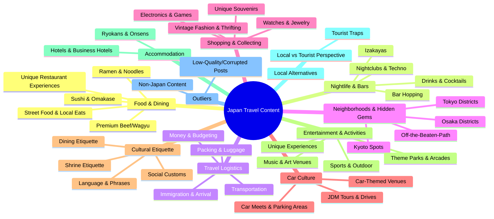

# 🗾 Japan Travel Content Clustering Analysis

> **Dataset Overview:** 150+ social media video posts analyzed across thematic, categorical, and relational dimensions. All content centers on Japan travel, culture, food, and nightlife — with a strong bias toward Osaka and Tokyo.

---

## 📊 Cluster Visualization

---

## 🍖 CLUSTER 1: Premium Beef & Wagyu Experiences

**Posts:** `post_0014`, `post_0025`, `post_0067`, `post_0105`, `post_0108`, `post_0184`

### Items & Details

| Post | Content | Specific Location/Name |
|------|---------|----------------------|
| `post_0014` | Best wagyu burger in Japan — smash patties brushed with wagyu fat, honey-glazed brioche bun, cured egg yolk | Unnamed wagyu burger restaurant, Osaka |
| `post_0025` | Top 10 wagyu restaurants in Tokyo; warns against trusting Google/Tabelog reviews | **Yakiniku Jambo** (featured), Tokyo |
| `post_0067` | 100% wagyu beef hamburger balls grilled over charcoal; includes clear soup, unlimited rice, ponzu | Unnamed restaurant (every person's list), Japan |
| `post_0105` | Texas-style wagyu BBQ food truck — learned via YouTube; beef ribs over rice | **Slice of Life** food truck, parked outside private home |
| `post_0108` | Full yakiniku omakase course: beef tongue, premium Kobi, A5 sirloin, Chateaubriand, beef sushi | **Jambo Hanare**, Tokyo (~$130/person prefix course) |
| `post_0184` | Premium wagyu steak recommendation for Osaka visitors | **Mikuya**, Osaka |

**Why These Cluster Together:** All posts revolve around premium Japanese beef (wagyu) as a central experience, featuring specialized preparation methods, specific cuts, high price points, and reverential language about the quality of beef. They share an audience of food-enthusiast travelers seeking elevated beef experiences.

---

## 🍜 CLUSTER 2: Ramen, Noodles & Bowl Dishes

**Posts:** `post_0036`, `post_0056`, `post_0186`, `post_0151` (partial), `post_0097` (partial)

### Items & Details

| Post | Content | Specific Location/Name |
|------|---------|----------------------|
| `post_0036` | Local alternative to Ichiran; Hakata-style tonkotsu ramen at 780 yen; in neighborhood of Komagome | **Hakata Ichigo**, Komagome, Tokyo |
| `post_0056` | Truffle ramen at brother of artist Nujabes's shop; 2300 yen; broth with garlic, mushroom & truffle | **Usagi Ramen** (Nujabes Brothers Ramen Shop), Tokyo |
| `post_0186` | Tsukemen (dipping ramen) — cold noodles + concentrated hot broth; recommends two spots | **Menya Musashi** (Tokyo), **Ginjo Ramen Kubota** (Kyoto) |
| `post_0107` | Small ramen shop owner Ken promoting his spot in Yotsuya, 5 min from station | **Ken's Ramen**, Yotsuya, Tokyo |
| `post_0031` | 10 yen per piece sushi/sashimi/tempura spots | Nameless Shinjuku spot, **Izakaya 50** (Kanda), **Chiyoda** (Nakano) |

**Why These Cluster Together:** These posts are united by the exploration of Japanese noodle and bowl culture — ramen in particular — often with a "local alternative to tourist spots" framing. Price transparency and specificity of the dish (tonkotsu, tsukemen, truffle) are common threads.

---

## 🍣 CLUSTER 3: Sushi & Omakase Culture

**Posts:** `post_0030`, `post_0065`, `post_0113`, `post_0109` (partial), `post_0163` (partial)

### Items & Details

| Post | Content | Specific Location/Name |
|------|---------|----------------------|
| `post_0030` | 3 taboos at omakase: no multiple bites, eat immediately when served, don't confuse oshibori; recommends restaurant | **Sushi Hatsume**, Shinjuku, Tokyo (22-dish omakase course) |
| `post_0065` | Spontaneous visit to Japanese-only menu sushi restaurant; rates unagi 10/10; 750 yen | **Fujisaku**, Tokyo |
| `post_0113` | 90-year-old family-owned Edo-style sushi shop; 3 generations running it | **Kokane**, Tokyo |
| `post_0109` | Three dining rules: no tipping, eat sushi with hands (fish side in soy sauce), 3.5 star = excellent on Japanese ratings | General Japan dining etiquette |
| `post_0163` | Travelers vs locals: expensive omakase vs franchise sushi (Sushiro, Kura Deshi) | **Sushiro**, **Kura Deshi** chains |

**Why These Cluster Together:** Sushi — specifically the etiquette, culture, quality markers, and hidden gems of sushi dining in Japan — unites these posts. They often combine experiential reviews with cultural education.

---

## 🍢 CLUSTER 4: Street Food, Local Eats & Unique Dining Experiences

**Posts:** `post_0013` (partial), `post_0021`, `post_0023`, `post_0064`, `post_0068`, `post_0100`, `post_0104`, `post_0120`, `post_0151`, `post_0154`, `post_0159`, `post_0161`, `post_0197`

### Items & Details

| Post | Content | Specific Location/Name |
|------|---------|----------------------|
| `post_0021` | 130-year-old karage rice bowl; 6 pieces fried chicken + Kyoto dashi egg; 12 seats; bans under-13s | Unnamed restaurant, Japan |
| `post_0023` | Tijuana-style taco truck in Japan with real trompo, taco de pastor (8.8 rating), taco de cabeza (8.7) | **Taco Shop** (Viva Mexico branding), Japan |
| `post_0064` | Izakaya couple (30 years) serving massive portions under $3; includes oversized omurice | **Mr. Monsoon's Izakaya**, Japan |
| `post_0068` | Okonomiyaki & takoyaki restaurant in Kyoto; solo traveler experience | **Tsubami**, Kyoto |
| `post_0100` | All-you-can-drink lemon sours on tap; yakiniku + unlimited cabbage | **Tokiwate Shibuya**, Tokyo |
| `post_0104` | Budget izakaya: 99 yen lemon sours, 199 yen craft beer, 99 yen fried chicken | Local izakaya, **Umeda**, Osaka |
| `post_0120` | Couple enjoying beer at busy restaurant/market | **Nishiki** restaurant, market area |
| `post_0151` | Full-day Osaka street food tour: golden sandwich, eel bowl, wagyu, sushi belt | **Sakimoto Bakery**, **Nagi Kushiaki Izumo**, **Kurumon Market**, Osaka |
| `post_0154` | Wagyu sandwiches in Osaka alleyway | **Tokito Sandwich Lunch**, Osaka side streets |
| `post_0159` | Catch-and-eat river fishing restaurant; real wasabi area | Unnamed fishing restaurant, Japan |
| `post_0197` | Cheapest bar: 2 yen sake jugs, octopus, crocodile dishes, police-costumed waitress | Unnamed ultra-cheap bar, Japan |

**Why These Cluster Together:** These posts share the theme of unique, memorable, or surprisingly affordable dining experiences — from ultra-cheap izakayas to novelty restaurants. The common thread is the discovery of non-obvious food experiences.

---

## 🌃 CLUSTER 5: Bars, Cocktails & Speakeasies

**Posts:** `post_0018`, `post_0039`, `post_0044`, `post_0082`, `post_0090`, `post_0102`, `post_0125`, `post_0131`, `post_0190`, `post_0211`

### Items & Details

| Post | Content | Specific Location/Name |
|------|---------|----------------------|
| `post_0018` | No-menu bar: pick a fruit, bartender makes cocktail; one of best bars in Asia | **Wonderbird** speakeasy, **Ginza**, Tokyo |
| `post_0039` | Cyberpunk karaoke bar in Golden Gai; every drink comes with a karaoke song | **Karma** bar, **Golden Gai**, Tokyo |
| `post_0044` | Bar with grandfather who spins records | Unnamed bar, **Shibuya** |
| `post_0082` | Golden Gai — 200+ bars in 6 alleys; favorite had guitar-playing owner | **Golden Gai**, Shinjuku, Tokyo |
| `post_0090` | Sci-fi/cyberpunk bar on 4th floor; drinks in beakers; dystopian plate; test tube shots | Unnamed futuristic bar (4th floor of random building) |
| `post_0102` | Three nerdcore drink experiences: death metal bar, kaiju/Ultraman bar, speakeasy coffee bar | **Deathmatch in Hell** (Golden Gai, 666 yen drinks), **Kaiju Sakaba** (Ultraman-themed), **Janai Coffee** (speakeasy, Ebisu) |
| `post_0125` | Restaurant with self-serve alcohol tap; 500 yen all-you-can-drink | Unnamed restaurant (DM for location) |
| `post_0131` | Hotel with sake dispensing machine; sake bar hotel | **Sake Bar Hotel Asakusa** |
| `post_0190` | Golden Gai guide: specific bar recommendations | **Open Book**, **Dan-san**, **Bar Okina** — all in Golden Gai |
| `post_0211` | Woman at record bar in Shibuya | Record bar, Shibuya |

**Why These Cluster Together:** These posts all center on the experience of unique, themed, or hidden bars and cocktail venues — particularly the underground/speakeasy/niche bar scene in Tokyo. Golden Gai appears as a sub-cluster within this group.

---

## 🎵 CLUSTER 6: Nightclubs & Music Venues

**Posts:** `post_0071`, `post_0073`, `post_0075`, `post_0081`, `post_0083`, `post_0110`

### Items & Details

| Post | Content | Specific Location/Name |
|------|---------|----------------------|
| `post_0071` | Best nightclubs in Tokyo by a resident DJ | **Warp** (EDM, Shinjuku), **Zero** (Techno/Hip-hop, Shinjuku), **C'est La Vie** (rooftop, Shibuya), **Baya** (hip-hop, Shibuya), **TK** (elevated EDM), **Womb** (techno), **Atom** (EDM), **Young Harlem** (OG hip-hop), **Vint** (Omotesando), **One Oak** (Roppongi, celebrities), **V2** (Roppongi), **R3** (reggaeton), **Cell Octagon** (EDM), **Raze** (Ginza, fancy), **ZOOP Tokyo** |
| `post_0073` | Three hip-hop clubs in Osaka | **Ghost** (hip-hop, rappers), **Giraffe** (rooftop, pool), **The Pink** (cheap drinks, go-go dancers) |
| `post_0075` | Shibuya Meetup — international social gathering vs going to clubs | **Shibuya Meetup** event |
| `post_0081` | Shimokitazawa live houses; Sleep House as standout | **Sleep House**, Shimokitazawa, Tokyo |
| `post_0083` | Nightclub in Shibuya with bar and DJ booth | Unnamed nightclub, Shibuya |
| `post_0110` | Best underground techno club: Ojo Building (dark, goth vibe); compares to Shibuya church | **Ojo Building**, Tokyo; **The Church**, Shibuya |

**Why These Cluster Together:** All about Tokyo/Osaka nightlife beyond bars — dedicated nightclubs, live music venues, and DJ culture. These posts share an audience of nightlife-oriented travelers and feature specific venue names and music genres.

---

## 🍶 CLUSTER 7: Izakayas — Local Drinking Culture

**Posts:** `post_0029`, `post_0062`, `post_0103`, `post_0112`, `post_0122`, `post_0156`, `post_0197` (partial), `post_0104`

### Items & Details

| Post | Content | Specific Location/Name |
|------|---------|----------------------|
| `post_0029` | Traditional izakaya in Tokyo neighborhood; shiokara (fermented squid), yakitori; no English menu; "Potato Woman" story | Unnamed hole-in-the-wall izakaya (screenshotted in video) |
| `post_0062` | Best lunch = where salarymen go; Shinbashi recommendation | **Shinbashi** area, Tokyo |
| `post_0103` | Best Izakaya in Japan; casual audio/Japanese conversation | **Best Izakaya in Japan**, Kawagoe |
| `post_0112` | Nakano izakayas; Takata Standado and Maguro Mato highlights; 200 yen drinks | **Takata Standado**, **Maguro Mato**, Nakano, Tokyo |
| `post_0122` | Hidden izakaya in Shibuya loved by locals; bread sashimi, salmon bowl, sake | Unnamed hidden izakaya, Shibuya |
| `post_0156` | Budget izakaya in Shinjuku's Kabukicho: all-you-can-drink $6, gyoza, yakitori 150 yen | **Kinfuku Sakaba**, Kabukicho, Shinjuku |

**Why These Cluster Together:** The izakaya — Japan's casual drinking-and-eating pub — is a distinct cultural institution. These posts specifically champion local, non-touristy izakayas as authentic Japan experiences, often in contrast to tourist-facing options.

---

## 🚗 CLUSTER 8: JDM Car Culture & Automotive Experiences

**Posts:** `post_0017`, `post_0026`, `post_0055`, `post_0061`, `post_0087`, `post_0095`, `post_0096`, `post_0130`, `post_0145`, `post_0171`

### Items & Details

| Post | Content | Specific Location/Name |
|------|---------|----------------------|
| `post_0017` | Secret night racing parking areas (PAs) in Tokyo | **Daikoku PA**, **Tatsumi PA**, **Umihatoru PA** (floats in Tokyo Bay), **Ebina PA**, **Okone Turnpike** |
| `post_0026` | Car enthusiast shop in Osaka with JDM cars, café, sim racers, car rental | **Mr. Hero Car Studio**, Osaka (sim racer: ¥1000/15min) |
| `post_0061` | Evening JDM tour through Tokyo landmarks | **Akabano Tokyo Drive** — Rainbow Bridge, Tokyo Tower, **Daikoku PA** |
| `post_0087` | Drove 4 legendary JDM cars 200 miles through mountains in one day | **Driver's Lounge** (near Shinjuku); R32 GTR, FD RX-7, R35 GTR, A90 Supra; **Mount Hakone** |
| `post_0095` | Midnight Cruise JDM tour with Liberty Walk collaboration; 3.5 hours through Tokyo | **Weyam Drive** — Shibuya, Rainbow Bridge, Tokyo Tower, **Daikoku**, **Umihatoru**, **Tatsumi** |
| `post_0096` | Fun2Drive Tours in Hakone; NSX and R34 GTR; Mahokone drive (~4 hours) | **Fun2Drive Tours**, **Hakone** |
| `post_0130` | Car-themed café/restaurant in Japan | Car café in Japanese car showroom |
| `post_0145` | Tokyo Drift-style car meet experience; Daikoku, Rainbow Bridge, Tokyo Tower | **Daikoku PA** car meet, Tokyo |
| `post_0171` | Boat race in Osaka | **Boat Race Suminoe**, Osaka |

**Why These Cluster Together:** Japan's car enthusiast culture — particularly JDM (Japanese Domestic Market) vehicles, night meets, mountain runs, and car-themed venues — forms a distinct and passionate subculture within the travel content. Daikoku PA appears as the single most-referenced car culture location.

---

## 🗺️ CLUSTER 9: Neighborhood Guides — Tokyo Districts

**Posts:** `post_0034`, `post_0035`, `post_0051`, `post_0069`, `post_0098`, `post_0112`, `post_0138`, `post_0203`, `post_0212`

### Items & Details

| Post | Content | Key Neighborhoods Mentioned |
|------|---------|---------------------------|
| `post_0034` | Free futuristic museum near Takanawa Gateway | **Mon Takanawa** (Museum of Narrative), **Takanawa Gateway City** |
| `post_0035` | Tourist trap alternatives | **Ebisu Yokucho**, **Kichijoji**, **Shimokitazawa**, **Koenji**, **Ebisu** back streets, **Sangen Jaya** |
| `post_0051` | Yamanote Line tourist map commentary (humorous) | **Ueno**, **Akihabara**, **Kanda**, **Ginza**, **Shinbashi**, **Ebisu**, **Shibuya**, **Shinjuku**, **Ikebukuro**, **Gotanda** |
| `post_0069` | Ranking